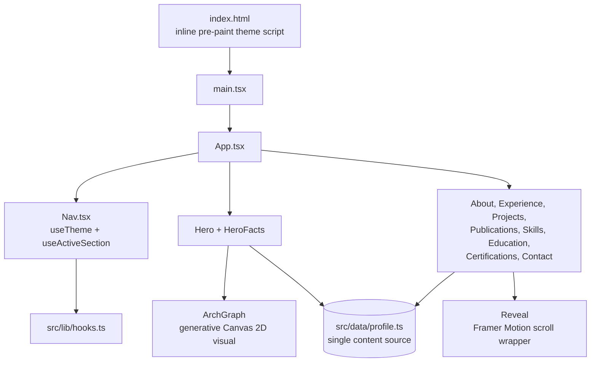

# Curriculum Vitae — Fellype Samuel de Melo

**Language:** English · [Português (Brasil)](./README.pt-BR.md)


A single-page, interactive personal portfolio/CV for **Fellype Samuel de Melo**, a Brazilian
software engineer focused on software architecture, software engineering, and applied AI.

> **Note on language:** the deployed site's content is Portuguese-only (`index.html` declares
> `lang="pt-BR"`, and every string in `src/data/profile.ts` is written in Portuguese). There is
> no in-app language toggle. This README is the only English-language artifact in the project.

## What this is, and why it exists

This repository is the source for a personal CV site: one continuous scrolling page with a
fixed navigation bar, built to present the author's experience, projects, publications, skills,
education, and certifications without a traditional PDF résumé. It doubles as a small showcase
of front-end craft — a generative Canvas 2D graphic in the hero, scroll-linked reveal animation,
a light/dark theme, and a single typed data module that drives every section.

There is no backend, no API, and no database. The output is a static bundle deployed to GitHub
Pages.

## Architecture

The whole page is one React tree, no router. `App.tsx` composes a fixed `Nav` and ten section
components in order (`Hero`, `HeroFacts`, `About`, `Experience`, `Projects`, `Publications`,
`Skills`, `Education`, `Certifications`, `Contact`); almost everything reads from one content module,
[`src/data/profile.ts`](./src/data/profile.ts), which is the single source of truth for the CV
data (profile, experience, projects, publications, skills, education, certifications,
languages, nav sections).



Key implementation details, verified against source:

- **Theming** (`src/lib/hooks.ts`, `useTheme`): explicit light/dark override persisted to
  `localStorage`; without an override it follows `prefers-color-scheme`. An inline script in
  `index.html` applies any saved theme before first paint, avoiding a flash of the wrong theme.
- **Scroll-spy nav** (`useActiveSection` in `src/lib/hooks.ts`, consumed by
  `src/components/layout/Nav.tsx`): an `IntersectionObserver` over the section ids picks the
  most-visible section as active.
- **Scroll-reveal** (`src/components/common/Reveal.tsx`): a Framer Motion wrapper around
  section content; it reduces to a static, non-animated render when
  `useReducedMotion()`/`prefers-reduced-motion` is set. The same guard is applied directly in
  `Hero.tsx` and in `src/components/visual/ArchGraph.tsx`.
- **ArchGraph** (`src/components/visual/ArchGraph.tsx`): a generative architecture-style graphic
  drawn with native Canvas 2D — no charting or animation library involved.
- **Styling**: Tailwind CSS v4 via `@tailwindcss/vite`, with theme tokens defined as CSS custom
  properties in `src/index.css`.

## Tech stack

Verified from `package.json`:

- **React 19** + **TypeScript 5.9**
- **Vite 7** — dev server and build
- **Tailwind CSS v4** (`@tailwindcss/vite`)
- **Framer Motion 12** — scroll-reveal animation
- **Lucide React** — icons
- **Fontsource** self-hosted variable fonts: Bricolage Grotesque, Archivo, Geist Mono
- **clsx** / **tailwind-merge** — class-name composition
- Native **Canvas 2D** for the hero visual (no chart/graphics library)

## Quickstart

Commands are copied from `package.json`; they have not been altered.

```bash
npm install
npm run dev       # Vite dev server, default http://localhost:5173
```

```bash
npm run build     # tsc -b && vite build — outputs to ./dist
npm run preview   # serve the built ./dist locally
npm run lint      # eslint .
```

There is no test command, because there is no test suite (see below).

## Deployment

The site is deployed to GitHub Pages by
[`.github/workflows/deploy.yml`](./.github/workflows/deploy.yml). Read that workflow carefully
before assuming it does more than it does:

- It triggers on push to `main`, or manual dispatch.
- Its only steps are `actions/checkout`, `actions/configure-pages`,
  `actions/upload-pages-artifact` (uploading the **already-committed** `./dist` folder), and
  `actions/deploy-pages`.
- **It never runs `npm install`, `npm run build`, lint, or tests.** It publishes whatever is
  already sitting in the tracked `dist/` directory.

This means `dist/` is checked into the repository and is exactly what ends up live. If you edit
anything under `src/` and push without first running `npm run build` locally and committing the
refreshed `dist/`, the deploy will silently ship stale content. See
[`CONTRIBUTING.md`](./CONTRIBUTING.md) for the release checklist.

No `CNAME` file and no `homepage` field are committed, so the exact live URL is not recorded in
this repository. Given the repository owner and name, and `vite.config.ts`'s relative
`base: './'`, the conventional GitHub Pages project URL would be
`https://fellypemelo.github.io/curriculum-vitae/` — confirm this against the repository's actual
Pages settings rather than treating it as a documented fact.

## Verified results

Everything below is copied as-is from [`src/data/profile.ts`](./src/data/profile.ts), the
project's single content source. This documentation pass does not independently verify DOIs or
external publication records — treat these as the author's stated CV facts, not as
externally-audited claims.

- One publication listed as first author: *"Arquitetura Algorítmica para Atenção Sustentável:
  o Modelo Be-Productive como Resposta à Sobrecarga Cognitiva no Capitalismo de Vigilância"*,
  Revista Tópicos, 2026, DOI
  [10.70773/revistatopicos/781363235](https://doi.org/10.70773/revistatopicos/781363235).
- One paper in preparation (embryo-classification Deep Learning pipeline, for submission to
  Latin.Science 2026) — no dataset, accuracy numbers, or code for that work live in this
  repository; it is cited here only as a CV fact.
- No software benchmarks, load tests, or performance numbers exist in this repository. It is a
  static informational site, not a measured service.

## Testing & CI — honest status

- **No automated test suite exists.** There is no test framework in `package.json` and no
  `*.test.*` / `*.spec.*` files anywhere in the tree.
- **ESLint is the only static check** (`eslint.config.js`: `@eslint/js` recommended +
  `typescript-eslint` + `eslint-plugin-react-hooks` + `eslint-plugin-react-refresh`), and it is
  run manually via `npm run lint`. It is **not** invoked by CI.
- The GitHub Actions workflow (`.github/workflows/deploy.yml`) is deploy-only, as described
  above — it does not build, lint, or test anything.

Retrofitting a test suite and wiring lint/build into CI are tracked as roadmap items below, not
implied as already done.

## Project layout

```
src/
├── components/
│   ├── common/       # Reveal — scroll-reveal wrapper (Framer Motion)
│   ├── layout/        # Nav — top bar, theme toggle, active-section highlighting
│   ├── sections/      # Hero, About, Experience, Projects, Publications,
│   │                  # Skills, Education, Certifications, Contact
│   └── visual/         # ArchGraph — generative Canvas 2D visual
├── data/profile.ts    # All CV content — single source of truth
├── lib/hooks.ts       # useTheme, useActiveSection
├── index.css          # Theme tokens, base styles, utilities
├── App.tsx
└── main.tsx
```

Root-level files: `index.html` (theme pre-paint script), `vite.config.ts`, `tsconfig*.json`,
`eslint.config.js`, and the GitHub Pages workflow under `.github/workflows/`.

## Further documentation

Deeper, per-topic documentation lives under [`docs/`](./docs/README.md), mirrored in English
and Portuguese:

- [`docs/en/architecture.md`](./docs/en/architecture.md) / [`docs/pt-BR/architecture.md`](./docs/pt-BR/architecture.md)
- [`docs/en/setup.md`](./docs/en/setup.md) / [`docs/pt-BR/setup.md`](./docs/pt-BR/setup.md)
- [`docs/en/deployment.md`](./docs/en/deployment.md) / [`docs/pt-BR/deployment.md`](./docs/pt-BR/deployment.md)
- [`docs/en/testing.md`](./docs/en/testing.md) / [`docs/pt-BR/testing.md`](./docs/pt-BR/testing.md)
- [`docs/en/roadmap.md`](./docs/en/roadmap.md) / [`docs/pt-BR/roadmap.md`](./docs/pt-BR/roadmap.md)

## Roadmap

- **Automated tests.** No unit, component, or end-to-end tests exist today. This is the largest
  gap for a project of this size.
- **Wire `lint`/`build` into CI.** The current workflow only publishes a committed `dist/`; it
  does not verify that `src/` still builds or lints cleanly.
- [**"Terminal Studio" redesign**](./docs/en/roadmap.md#exploratory-plan-terminal-studio-redesign-not-implemented)
  is an unimplemented, exploratory dark/CLI redesign plan. It is a planning document only — it
  contradicts the shipped "Ink & Signal" editorial design described above and has not been
  built. It used to sit at `conductor/terminal-studio-plan.md`; it has been relocated
  (`git mv`) into the internal docs tree (see "Further documentation" above) so it reads as a
  roadmap note rather than as undocumented clutter at the repository root.
- **In-app language toggle.** The site is Portuguese-only today; an English (or bilingual)
  in-app mode is not implemented.

See [`docs/en/roadmap.md`](./docs/en/roadmap.md) for the full, up-to-date roadmap.

## License

This repository is **not** open source and is **not** MIT-licensed, despite what an earlier
version of this README claimed. The actual terms are in [`LICENSE`](./LICENSE):

> Copyright (c) 2025 Fellype Samuel Dos Santos de Melo. All rights reserved. The code, design,
> and layout are proprietary. Viewing is permitted for educational purposes or to evaluate the
> author's professional portfolio. Copying, redistribution, derivative works, or commercial use
> are **not** permitted without the author's explicit written permission.

Read the full [`LICENSE`](./LICENSE) file before reusing anything from this repository.

## Author

Built by [Fellype Melo](https://github.com/FellypeMelo).
