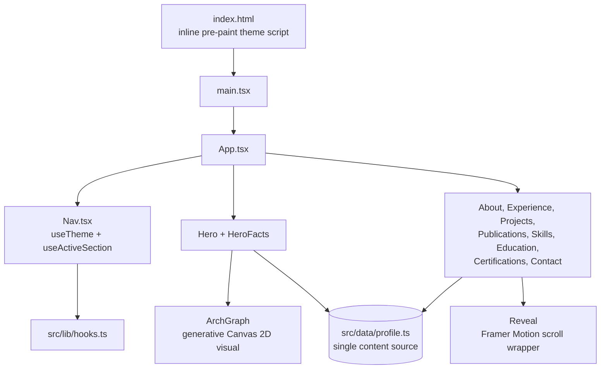

# Architecture

**Language:** English · [Português (Brasil)](../pt-BR/architecture.md)

This document describes how the codebase is put together, verified directly against the source
in this repository. It expands on the summary in the root [`README.md`](../../README.md); if the
two ever disagree, trust this file for depth and the README for the one-paragraph version.

## Shape of the app

There is no router and no client-side routing library. `curriculum-vitae` is a single React tree
mounted once, rendered as one continuously scrolling page with a fixed navigation bar. There is
no backend, no API, and no database — the entire application is static markup, CSS and
JavaScript produced by a Vite build.



## Entry point and theme pre-paint

[`index.html`](../../index.html) declares `lang="pt-BR"` (the whole shipped site is
Portuguese-only — see [Language](#language) below) and inlines a small script that runs before
any React code:

```html
<script>
  // Set theme before paint to avoid a flash of the wrong theme.
  (function () {
    try {
      var saved = localStorage.getItem('theme');
      if (saved === 'light' || saved === 'dark') {
        document.documentElement.setAttribute('data-theme', saved);
      }
    } catch (e) {}
  })();
</script>
```

If the visitor previously chose a theme, it is applied as a `data-theme` attribute on
`<html>` before the first paint, so there is no flash of the wrong theme while React hydrates.
`main.tsx` then mounts `App.tsx` into `#root`.

## `App.tsx`: section composition

[`src/App.tsx`](../../src/App.tsx) renders, in order: a skip-to-content link, `Nav`, then a
`<main>` containing `Hero`, `HeroFacts`, `About`, `Experience`, `Projects`, `Publications`,
`Skills`, `Education`, `Certifications`, `Contact` — ten section components (`Hero` and
`HeroFacts` are both exported from the same `Hero.tsx` file) pulled from
`src/components/sections/`. There is no conditional rendering or route-based code-splitting;
every section always renders, and the page's structure is exactly this fixed list.

## `src/data/profile.ts`: the single source of truth

Every piece of CV content — profile identity, experience, projects, publications, skills,
education, certifications, spoken languages, and the nav section list — is exported from one
typed module, [`src/data/profile.ts`](../../src/data/profile.ts). There is no CMS and no
external content API; changing the CV means editing this file. Its exports, verified by name:

| Export | Shape | Consumed by |
| --- | --- | --- |
| `PROFILE` | object (name, roles, contact links, thesis copy, summary) | `Hero`, `About`, `Contact` |
| `FACTS` | `{ label, value }[]` | `HeroFacts` |
| `EXPERIENCE` | `ExperienceItem[]` | `Experience` |
| `PROJECTS` | `ProjectItem[]` | `Projects` |
| `PUBLICATIONS` | `PublicationItem[]` | `Publications` |
| `SKILL_GROUPS` | `SkillGroup[]` | `Skills` |
| `EDUCATION` | `EducationItem[]` | `Education` |
| `CERTIFICATIONS` | `CertItem[]` | `Certifications` |
| `LANGUAGES` | `{ name, level }[]` | `Skills` |
| `SECTIONS` | `{ id, label }[]` | Not imported anywhere in `src/` — see note below |

`FACTS` is explicitly commented in the source as "real, verifiable facts (not invented
metrics)" — a deliberate choice by the author to avoid decorative, unverifiable numbers in the
hero fact strip.

**`SECTIONS` is dead code.** It is exported from `profile.ts` but not imported anywhere else in
`src/` (verified by grep). [`src/components/layout/Nav.tsx`](../../src/components/layout/Nav.tsx)
defines its own local `LINKS` array with the same ids and labels instead of importing `SECTIONS`,
so the two lists have to be kept in sync by hand. This is a real duplication in the source, not a
documentation simplification — worth consolidating (have `Nav.tsx` import `SECTIONS` and drop the
local copy) the next time `src/components/layout/Nav.tsx` changes.

## Hooks: `src/lib/hooks.ts`

Two hooks, both consumed by [`src/components/layout/Nav.tsx`](../../src/components/layout/Nav.tsx):

- **`useTheme()`** — Resolves the current theme by reading the `data-theme` attribute on
  `<html>`; if absent, falls back to `window.matchMedia('(prefers-color-scheme: dark)')`. Calling
  `toggle()` flips the theme, writes it to the `data-theme` attribute, and persists it to
  `localStorage` under the key `theme` (wrapped in a `try`/`catch` in case storage is
  unavailable). A `matchMedia` change listener keeps the theme in sync with the OS preference
  for as long as the visitor has not set an explicit override.
- **`useActiveSection(ids: string[])`** — Backs the scroll-spy nav highlighting. It creates one
  `IntersectionObserver` (with `rootMargin: '-45% 0px -45% 0px'` and multiple thresholds) over
  whatever ids it is given, and sets the active id to whichever observed section currently has
  the highest intersection ratio. `Nav.tsx` calls it with `['inicio', ...LINKS.map((l) => l.id),
  'contato']` — its own local id list, not the `SECTIONS` export (see the dead-code note above).

## Scroll-reveal: `Reveal`

[`src/components/common/Reveal.tsx`](../../src/components/common/Reveal.tsx) wraps section
content in a Framer Motion `motion.div` that animates from `opacity: 0` / a `y` offset to fully
visible once it scrolls into view (`whileInView`, `viewport={{ once: true, amount: 0.2 }}`).
It calls Framer Motion's `useReducedMotion()` and, when the visitor has
`prefers-reduced-motion` set, skips the initial hidden state entirely — content renders directly
in its final position instead of animating in. The same reduced-motion guard is applied
independently inside `Hero.tsx` and inside `ArchGraph.tsx`.

## The hero visual: `ArchGraph`

[`src/components/visual/ArchGraph.tsx`](../../src/components/visual/ArchGraph.tsx) draws a
generative, ambient graph directly on a native `<canvas>` element using the Canvas 2D API — no
charting, physics, or animation library is involved. At a glance:

- Node count scales with the canvas's rendered area (`Math.max(14, Math.min(42, (w * h) /
  22000))`), each node given a small random velocity.
- Every seventh node (`i % 7 === 0`) is flagged as a `hub` and rendered with emphasis.
- Colors are read live from the page's CSS custom properties (`--c-border`, `--c-dim`,
  `--c-accent`) via `getComputedStyle`, so the graph automatically follows the active light/dark
  theme rather than hardcoding colors.
- `window.matchMedia('(prefers-reduced-motion: reduce)')` is checked once on mount; when set, the
  animation loop is skipped in favor of a static render.
- `devicePixelRatio` is capped at 2 to bound canvas resolution/cost on high-DPI displays.

This is a decorative, on-theme visual (a system-architecture-style graph, fitting the author's
stated focus on software architecture) rather than a data visualization — it does not plot any
real dataset.

## Styling

Tailwind CSS v4 is wired in through [`@tailwindcss/vite`](../../vite.config.ts) rather than a
PostCSS config file. Theme tokens (colors, spacing, etc.) are defined as CSS custom properties in
[`src/index.css`](../../src/index.css) and consumed both by Tailwind utility classes and directly
by `ArchGraph`'s canvas drawing code, which is how the canvas visual stays in sync with the
Tailwind-driven theme.

## Language

`index.html` declares `lang="pt-BR"` and every string in `src/data/profile.ts` is written in
Brazilian Portuguese. There is no i18n library, no language switcher component, and no English
content path anywhere in the running application — bilingual support exists only in this
documentation tree and the root README pair, not in the deployed site itself. See
[`roadmap.md`](./roadmap.md) for this tracked as an open gap.

## What is out of scope here

There is no backend service, API layer, database, authentication, or server-rendering step to
document — this is a fully static site. For how the static build is produced and shipped, see
[`setup.md`](./setup.md) and [`deployment.md`](./deployment.md). For the current state of
automated testing, see [`testing.md`](./testing.md).
