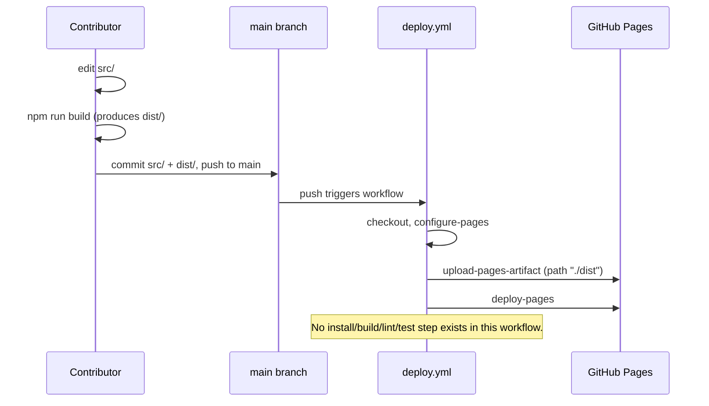

# Deployment

**Language:** English · [Português (Brasil)](../pt-BR/deployment.md)

## The one workflow: `deploy.yml`

The site is deployed to GitHub Pages by a single GitHub Actions workflow,
[`.github/workflows/deploy.yml`](../../.github/workflows/deploy.yml). Read its steps directly —
they are short enough to quote in full:

```yaml
on:
  push:
    branches: ["main"]
  workflow_dispatch:

jobs:
  deploy:
    steps:
      - uses: actions/checkout@v4
      - uses: actions/configure-pages@v5
      - uses: actions/upload-pages-artifact@v3
        with:
          path: "./dist"
      - uses: actions/deploy-pages@v4
```

That is the entire job. Triggers: a push to `main`, or manual dispatch from the Actions tab.
Steps: checkout, configure Pages, upload the content of `./dist` as the Pages artifact, deploy
that artifact.

## What it does **not** do

This is the part that matters most for anyone contributing source changes:

- It never runs `npm install`.
- It never runs `npm run build`.
- It never runs `npm run lint`.
- It never runs any tests (there are none to run — see [`testing.md`](./testing.md)).

It uploads the **already-committed** `dist/` directory exactly as it sits in the repository at
the commit that triggered the run. `dist/` is a normal tracked directory in this repository, not
a build artifact excluded via `.gitignore`.

## Consequence: `src/` changes need a manual rebuild-and-commit step

If you edit anything under `src/`, `index.html`, `vite.config.ts`, `tailwind`-related config, or
any other input to the build, **the live site will not change** until someone:

1. Runs `npm run build` locally (`tsc -b && vite build`, producing a fresh `dist/`).
2. Commits the regenerated `dist/` alongside the source change, in the same commit or PR.
3. Pushes (or merges a PR containing both) to `main`.

A PR that changes `src/` without an updated `dist/` will build fine locally and pass review, but
the deployed site will keep serving the old bundle after it is merged, because the workflow only
re-publishes whatever `dist/` already contains.



## Release checklist

Before any push to `main` that is meant to change the live site:

- [ ] `npm run lint` — no errors (not enforced by CI; check manually).
- [ ] `npm run build` — completes without type errors and regenerates `dist/`.
- [ ] `git status` shows `dist/` as changed, and it is staged alongside the `src/` change.
- [ ] Optionally, `npm run preview` to sanity-check the freshly built `dist/` before pushing.

The same checklist, phrased for contributors, lives in
[`../../CONTRIBUTING.md`](../../CONTRIBUTING.md).

## Live URL

No `CNAME` file and no `homepage` field in `package.json` are committed in this repository, so
the exact live GitHub Pages URL is not recorded anywhere in the tracked source. Given the
repository owner and name, and [`vite.config.ts`](../../vite.config.ts)'s relative `base: './'`
(which only makes sense for a project-pages deployment, not a user/organization root page), the
conventional GitHub Pages project URL would be `https://fellypemelo.github.io/curriculum-vitae/`.
Treat that as an inference from the repository's own configuration, not as a fact verified
against GitHub's Pages settings — confirm it there before publishing it further.

## Rollback

There is no dedicated rollback tooling or workflow. Because `dist/` is a normal tracked
directory, reverting to a previous known-good deployment means reverting (or checking out) the
commit that contains the previous `dist/` state and pushing that to `main` — the same as
reverting any other tracked file, with no special CI support either way.
