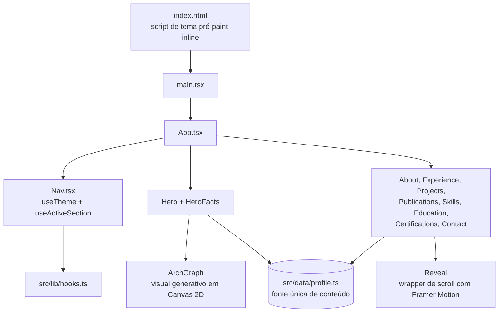

# Arquitetura

**Idioma:** Português (Brasil) · [English](../en/architecture.md)

Este documento descreve como o código está organizado, verificado diretamente contra o código-
fonte deste repositório. Ele expande o resumo do [`README.md`](../../README.pt-BR.md) na raiz;
se os dois divergirem em algum momento, confie neste arquivo para profundidade e no README para
a versão de um parágrafo.

## Formato da aplicação

Não há roteador nem roteamento no lado do cliente. `curriculum-vitae` é uma única árvore React
montada uma vez, renderizada como uma página de rolagem contínua com uma barra de navegação
fixa. Não há backend, API ou banco de dados — a aplicação inteira é HTML, CSS e JavaScript
estáticos produzidos por um build do Vite.



## Ponto de entrada e tema pré-paint

[`index.html`](../../index.html) declara `lang="pt-BR"` (o site publicado é inteiramente em
português — veja [Idioma](#idioma) mais abaixo) e injeta um pequeno script inline que roda antes
de qualquer código React:

```html
<script>
  // Set theme before paint to avoid a flash of the wrong theme.
  (function () {
    try {
      var saved = localStorage.getItem('theme');
      if (saved === 'light' || saved === 'dark') {
        document.documentElement.setAttribute('data-theme', saved);
      }
    } catch (e) {}
  })();
</script>
```

Se o visitante já escolheu um tema anteriormente, ele é aplicado como atributo `data-theme` em
`<html>` antes do primeiro paint, evitando o flash do tema errado enquanto o React hidrata a
página. Em seguida, `main.tsx` monta `App.tsx` em `#root`.

## `App.tsx`: composição das seções

[`src/App.tsx`](../../src/App.tsx) renderiza, nesta ordem: um link "pular para o conteúdo",
`Nav`, e então um `<main>` contendo `Hero`, `HeroFacts`, `About`, `Experience`, `Projects`,
`Publications`, `Skills`, `Education`, `Certifications`, `Contact` — dez componentes de seção
(`Hero` e `HeroFacts` são exportados do mesmo arquivo `Hero.tsx`) vindos de
`src/components/sections/`. Não há renderização condicional nem code-splitting por rota: todas
as seções sempre renderizam, e a estrutura da página é exatamente essa lista fixa.

## `src/data/profile.ts`: a fonte única de verdade

Todo o conteúdo do currículo — identidade do perfil, experiência, projetos, publicações,
habilidades, formação, certificações, idiomas falados e a lista de seções da navegação — é
exportado de um único módulo tipado, [`src/data/profile.ts`](../../src/data/profile.ts). Não há
CMS nem API externa de conteúdo: alterar o currículo significa editar este arquivo. Seus
exports, verificados por nome:

| Export | Formato | Consumido por |
| --- | --- | --- |
| `PROFILE` | objeto (nome, papéis, links de contato, texto da tese, resumo) | `Hero`, `About`, `Contact` |
| `FACTS` | `{ label, value }[]` | `HeroFacts` |
| `EXPERIENCE` | `ExperienceItem[]` | `Experience` |
| `PROJECTS` | `ProjectItem[]` | `Projects` |
| `PUBLICATIONS` | `PublicationItem[]` | `Publications` |
| `SKILL_GROUPS` | `SkillGroup[]` | `Skills` |
| `EDUCATION` | `EducationItem[]` | `Education` |
| `CERTIFICATIONS` | `CertItem[]` | `Certifications` |
| `LANGUAGES` | `{ name, level }[]` | `Skills` |
| `SECTIONS` | `{ id, label }[]` | Não importado em nenhum lugar de `src/` — veja a nota abaixo |

`FACTS` traz um comentário explícito no código-fonte dizendo que são "fatos reais e
verificáveis (não métricas inventadas)" — uma escolha deliberada do autor para evitar números
decorativos e não verificáveis na faixa de destaques do hero.

**`SECTIONS` é código morto.** É exportado de `profile.ts`, mas não é importado em nenhum outro
lugar de `src/` (verificado via grep).
[`src/components/layout/Nav.tsx`](../../src/components/layout/Nav.tsx) define seu próprio array
local `LINKS` com os mesmos ids e labels em vez de importar `SECTIONS`, então as duas listas
precisam ser mantidas sincronizadas manualmente. É uma duplicação real no código-fonte, não uma
simplificação da documentação — vale a pena consolidar (fazer `Nav.tsx` importar `SECTIONS` e
remover a cópia local) na próxima vez que `src/components/layout/Nav.tsx` for alterado.

## Hooks: `src/lib/hooks.ts`

Dois hooks, ambos consumidos por [`src/components/layout/Nav.tsx`](../../src/components/layout/Nav.tsx):

- **`useTheme()`** — Resolve o tema atual lendo o atributo `data-theme` em `<html>`; se ausente,
  recorre a `window.matchMedia('(prefers-color-scheme: dark)')`. Chamar `toggle()` inverte o
  tema, grava o atributo `data-theme` e persiste a escolha em `localStorage` sob a chave `theme`
  (protegido por `try`/`catch` caso o storage não esteja disponível). Um listener de mudança do
  `matchMedia` mantém o tema sincronizado com a preferência do sistema operacional enquanto o
  visitante não tiver definido uma preferência explícita.
- **`useActiveSection(ids: string[])`** — Sustenta o destaque de scroll-spy na navegação. Cria um
  único `IntersectionObserver` (com `rootMargin: '-45% 0px -45% 0px'` e vários thresholds) sobre
  os ids que recebe como argumento, e define como ativo o id da seção observada com a maior taxa
  de interseção no momento. `Nav.tsx` o chama com `['inicio', ...LINKS.map((l) => l.id),
  'contato']` — sua própria lista local de ids, não o export `SECTIONS` (veja a nota de código
  morto acima).

## Scroll-reveal: `Reveal`

[`src/components/common/Reveal.tsx`](../../src/components/common/Reveal.tsx) envolve o conteúdo
das seções em uma `motion.div` do Framer Motion, que anima de `opacity: 0` / um deslocamento em
`y` até totalmente visível assim que entra na tela (`whileInView`, `viewport={{ once: true,
amount: 0.2 }}`). Ele chama o `useReducedMotion()` do Framer Motion e, quando o visitante tem
`prefers-reduced-motion` ativado, pula completamente o estado inicial oculto — o conteúdo já
renderiza direto na posição final, sem animação de entrada. A mesma proteção para movimento
reduzido é aplicada de forma independente dentro de `Hero.tsx` e de `ArchGraph.tsx`.

## O visual do hero: `ArchGraph`

[`src/components/visual/ArchGraph.tsx`](../../src/components/visual/ArchGraph.tsx) desenha um
grafo ambiente e generativo diretamente em um elemento `<canvas>` nativo usando a API Canvas 2D
— nenhuma biblioteca de gráficos, física ou animação está envolvida. Em resumo:

- A quantidade de nós escala com a área renderizada do canvas (`Math.max(14, Math.min(42, (w *
  h) / 22000))`), cada um com uma pequena velocidade aleatória.
- A cada sete nós (`i % 7 === 0`) um é marcado como `hub` e renderizado com destaque.
- As cores são lidas em tempo real das custom properties CSS da página (`--c-border`, `--c-dim`,
  `--c-accent`) via `getComputedStyle`, então o grafo acompanha automaticamente o tema
  claro/escuro ativo em vez de ter cores fixas no código.
- `window.matchMedia('(prefers-reduced-motion: reduce)')` é verificado uma vez ao montar; quando
  ativo, o loop de animação é pulado em favor de uma renderização estática.
- `devicePixelRatio` é limitado a 2 para conter a resolução/custo do canvas em telas de alta
  densidade de pixels.

Trata-se de um visual decorativo e temático (um grafo no estilo arquitetura-de-sistemas,
coerente com o foco declarado do autor em arquitetura de software), não uma visualização de
dados — ele não plota nenhum dataset real.

## Estilização

O Tailwind CSS v4 é integrado via [`@tailwindcss/vite`](../../vite.config.ts) em vez de um
arquivo de configuração PostCSS. Os tokens de tema (cores, espaçamento etc.) são definidos como
custom properties CSS em [`src/index.css`](../../src/index.css) e consumidos tanto pelas classes
utilitárias do Tailwind quanto diretamente pelo código de desenho do canvas do `ArchGraph`, que é
como o visual do canvas se mantém sincronizado com o tema controlado pelo Tailwind.

## Idioma

`index.html` declara `lang="pt-BR"` e toda string em `src/data/profile.ts` está escrita em
português do Brasil. Não há biblioteca de i18n, nenhum componente de seletor de idioma e nenhum
caminho de conteúdo em inglês em nenhum lugar da aplicação em execução — o suporte bilíngue
existe apenas nesta árvore de documentação e no par de READMEs da raiz, não no site publicado em
si. Veja [`roadmap.md`](./roadmap.md) para essa lacuna registrada como pendência.

## O que fica fora do escopo aqui

Não há serviço de backend, camada de API, banco de dados, autenticação ou etapa de renderização
no servidor para documentar — este é um site totalmente estático. Para como o build estático é
gerado e publicado, veja [`setup.md`](./setup.md) e [`deployment.md`](./deployment.md). Para o
estado atual dos testes automatizados, veja [`testing.md`](./testing.md).
