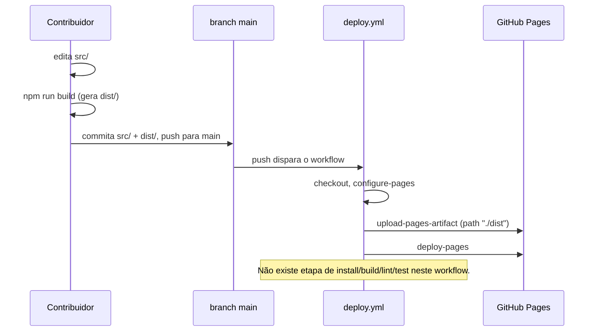

# Deploy

**Idioma:** Português (Brasil) · [English](../en/deployment.md)

## O único workflow: `deploy.yml`

O site é publicado no GitHub Pages por um único workflow do GitHub Actions,
[`.github/workflows/deploy.yml`](../../.github/workflows/deploy.yml). Vale ler os passos
diretamente — são curtos o suficiente para citar por completo:

```yaml
on:
  push:
    branches: ["main"]
  workflow_dispatch:

jobs:
  deploy:
    steps:
      - uses: actions/checkout@v4
      - uses: actions/configure-pages@v5
      - uses: actions/upload-pages-artifact@v3
        with:
          path: "./dist"
      - uses: actions/deploy-pages@v4
```

Esse é o job inteiro. Gatilhos: push na branch `main`, ou disparo manual na aba Actions. Passos:
checkout, configurar o Pages, enviar o conteúdo de `./dist` como artefato do Pages, publicar
esse artefato.

## O que ele **não** faz

Esta é a parte mais importante para quem contribui com mudanças de código:

- Ele nunca roda `npm install`.
- Ele nunca roda `npm run build`.
- Ele nunca roda `npm run lint`.
- Ele nunca roda nenhum teste (não há nenhum para rodar — veja [`testing.md`](./testing.md)).

Ele envia o diretório `dist/` **já commitado**, exatamente como está no repositório no commit
que disparou a execução. `dist/` é um diretório versionado normal neste repositório, não um
artefato de build excluído via `.gitignore`.

## Consequência: mudanças em `src/` exigem rebuild e commit manuais

Se você editar qualquer coisa em `src/`, `index.html`, `vite.config.ts`, configurações
relacionadas ao Tailwind, ou qualquer outra entrada do build, **o site publicado não vai mudar**
até que alguém:

1. Rode `npm run build` localmente (`tsc -b && vite build`, gerando um `dist/` atualizado).
2. Commite o `dist/` regenerado junto com a mudança de código, no mesmo commit ou PR.
3. Faça push (ou faça merge de um PR contendo os dois) para `main`.

Um PR que altera `src/` sem atualizar `dist/` vai buildar normalmente localmente e passar na
revisão, mas o site publicado continuará servindo o bundle antigo depois do merge, porque o
workflow apenas republica o que já estiver em `dist/`.



## Checklist de release

Antes de qualquer push para `main` que deva alterar o site publicado:

- [ ] `npm run lint` — sem erros (não é verificado pelo CI; checar manualmente).
- [ ] `npm run build` — conclui sem erros de tipo e regenera `dist/`.
- [ ] `git status` mostra `dist/` como alterado, e ele está staged junto com a mudança em `src/`.
- [ ] Opcionalmente, `npm run preview` para validar o `dist/` recém-gerado antes do push.

O mesmo checklist, para quem contribui, está em
[`../../README.pt-BR.md`](../../README.pt-BR.md) (o `CONTRIBUTING.md` detalhado existe apenas em
inglês).

## URL ao vivo

Não há arquivo `CNAME` nem campo `homepage` em `package.json` commitados neste repositório,
então a URL exata do GitHub Pages ao vivo não está registrada em nenhum lugar do código
versionado. Dados o dono e o nome do repositório, e o `base: './'` relativo em
[`vite.config.ts`](../../vite.config.ts) (que só faz sentido para um deploy de project pages, não
para uma página raiz de usuário/organização), a URL convencional de project pages do GitHub
seria `https://fellypemelo.github.io/curriculum-vitae/`. Trate isso como uma inferência a partir
da própria configuração do repositório, não como um fato verificado nas configurações de Pages
do GitHub — confirme lá antes de divulgar essa URL mais amplamente.

## Rollback

Não existe nenhuma ferramenta ou workflow dedicado a rollback. Como `dist/` é um diretório
versionado normal, voltar a um estado de deploy anteriormente funcional significa reverter o
commit que contém o `dist/` daquele estado (ou dar checkout nele) e então dar push para `main`
— o mesmo procedimento usado para reverter qualquer outro arquivo versionado, sem nenhum suporte
especial de CI em nenhum dos dois casos.
